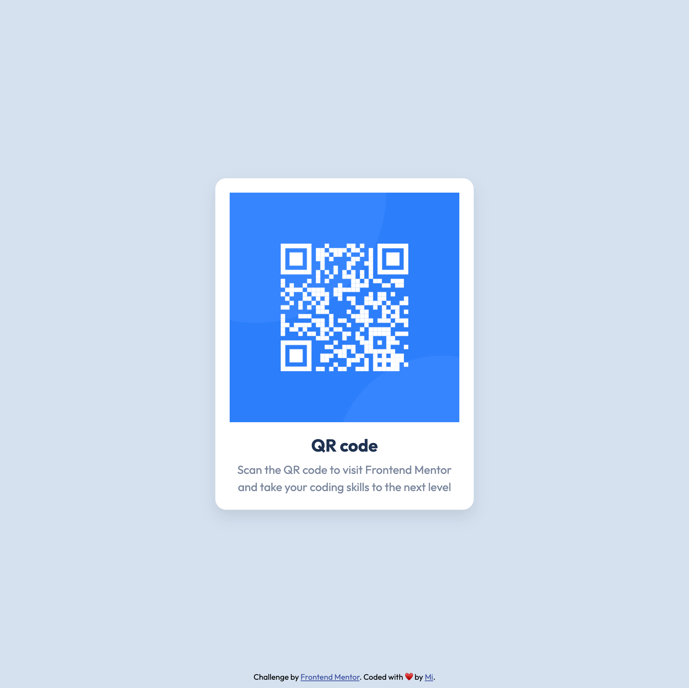

# Frontend Mentor - QR code component solution

This is a solution to the [QR code component challenge on Frontend Mentor](https://www.frontendmentor.io/challenges/qr-code-component-iux_sIO_H). Frontend Mentor challenges help you improve your coding skills by building realistic projects. 

## Table of contents

- [Overview](#overview)
  - [Screenshot](#screenshot)
  - [Links](#links)
- [Author](#author)

## Overview

### Screenshot

### Links

- Solution URL: [https://github.com/mileine/frontendmentor-qr-code-component](https://github.com/mileine/frontendmentor-qr-code-component)
- Live Site URL: [https://frontendmentor-qr-code-component-pied.vercel.app](https://frontendmentor-qr-code-component-pied.vercel.app)

## Author

- Frontend Mentor - [@mileine](https://www.frontendmentor.io/profile/mileine)
